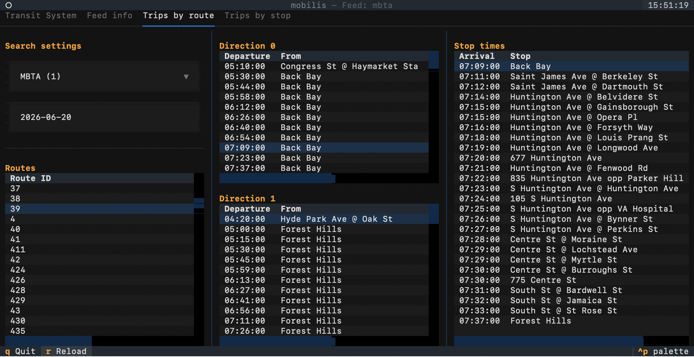

# mobilis go

`mobilis go` launches the **passenger TUI**: a keyboard-driven dashboard for browsing GTFS transit schedules locally.

```bash
mobilis go                  # start and choose a feed interactively
mobilis go <feed_id>        # load a specific feed on startup
```

If `<feed_id>` refers to a feed that has not been downloaded yet, `mobilis go` will fetch and import it automatically before opening the dashboard.

## Keybindings

| Key   | Action          |
| ----- | --------------- |
| ++q++ | Quit            |
| ++r++ | Reload all data |

Navigation between tabs uses the mouse or the arrow keys when a tab is focused.

---

## Tab: Transit System

The first tab is the entry point for feed management within the TUI.

### Feed search

Two search bars are available at the top of the tab:

**Search provider or feed name**
: Fuzzy text search across the bundled Mobility Database catalog (≈ 2 500 GTFS feeds worldwide). Press ++enter++ or click **Search** to filter the catalog table below.

**Search place**
: Geocodes a place name using the [Nominatim](https://nominatim.openstreetmap.org/) API, then filters the catalog to feeds whose geographic bounding box contains that point. After the geocoder returns results, select the correct place and click **Find feeds for place**.

### Downloaded feeds table

Lists every feed already downloaded into `~/.mobilis/feeds/`. Select a row and click **Load selected feed** to open it in the dashboard.

### Catalog feeds table

Lists all GTFS feeds from the Mobility Database catalog. Select a row and click **Load selected feed** to download, import and activate the feed — all in one step. This may take up to a minute depending on feed size.

!!! note "Feed IDs"
Catalog feeds use IDs of the form `mdb-<number>` or `tld-<number>`. Feeds you add manually (e.g. `incofer`, `mbta`) can use any name that is also the directory name under `~/.mobilis/feeds/`.

---

## Tab: Feed info

Displays metadata and basic statistics for the currently loaded feed.

### Feed information

Fields read from `feed_info.txt` (when present in the feed):

| Field                 | Description                          |
| --------------------- | ------------------------------------ |
| `feed_publisher_name` | Organisation that publishes the feed |
| `feed_publisher_url`  | Publisher's website                  |
| `feed_lang`           | Default language of the feed         |
| `feed_start_date`     | First day covered by the feed        |
| `feed_end_date`       | Last day covered by the feed         |
| `feed_version`        | Feed version string                  |
| `feed_contact_email`  | Contact email for feed issues        |
| `feed_contact_url`    | Contact URL for feed issues          |

When `feed_info.txt` is absent from the feed, a notice is shown.

### Feed stats

| Metric   | Source                                                   |
| -------- | -------------------------------------------------------- |
| Routes   | Count of rows in `routes.txt`                            |
| Stops    | Count of rows in `stops.txt`                             |
| Stations | Count of stops with `location_type = 1` (when available) |

---

## Tab: Trips by route

Browse the trip schedule for any route in the loaded feed.



### Layout

The tab is divided into three columns:

**Column 1 — Search settings + Routes**

: Select an **agency** from the dropdown, set a **date** (default: today) and optionally set a time window with **lower limit** and **upper limit** (e.g. `07:00:00`). Click **Refresh trips** (or press ++enter++ in a filter field) to apply. The routes table below lists all routes for the selected agency.

**Column 2 — Trips**

: After selecting a route, the matching trips are shown split into two groups:

- _Direction 0_ — outbound trips.
- _Direction 1_ — inbound (return) trips.

Each row shows departure time, first stop (_From_) and last stop (_To_).

If no trips are found for the current date, a persistent warning suggests the next date on which service runs.

**Column 3 — Stop times**

: After selecting a trip in column 2, the full stop-time sequence (arrival time and stop name) is shown here.

---

## Tab: Trips by stop

Browse all upcoming arrivals at a chosen stop.

### Layout

The tab is divided into three columns:

**Column 1 — Search**

: Select a **route** to filter the stops list. Additional search options (by stop name, place and radius) are reserved for a future release.

**Column 2 — Stops**

: Lists every stop served by the selected route. Select a row to view its arrivals.

**Column 3 — Next arrivals**

: After selecting a stop, shows all trips that call at that stop on the active date, with the route, scheduled arrival time and headsign.

---

## GTFS queries

All data is read from `~/.mobilis/feeds/<feed_id>/<feed_id>.duckdb` using a set of DuckDB temporary macros defined in `src/mobilis/queries.sql`:

| Macro                                   | Purpose                      |
| --------------------------------------- | ---------------------------- |
| `routes_by_agency(agency_id)`           | Routes for a given agency    |
| `active_trips_by_route(date, route_id)` | Trips active on a date       |
| `stop_times_by_trip(trip_id)`           | Stop sequence for a trip     |
| `stops_by_route(route_id)`              | Stops served by a route      |
| `trips_by_stop(date, stop_id)`          | Arrivals at a stop on a date |
